# Legato Frontend Complete Design Document

## Overview

This design document outlines the comprehensive frontend development for Legato, building upon the existing Next.js/React foundation to create a complete, beautiful, and highly functional user interface. The design focuses on creating an enhanced landing page with 10+ sections, all necessary application pages, and seamless API integration while maintaining the mobile-first approach and warm, storytelling-focused aesthetic.

The frontend will leverage the existing architecture while expanding it significantly to include enhanced user experiences, comprehensive page coverage, and advanced interactive features that showcase Legato's unique value proposition as a platform where "stories become IP."

## Architecture

### Frontend Technology Stack

**Core Framework**
- Next.js 14+ with App Router for optimal performance and SEO
- React 18+ with TypeScript for type safety and developer experience
- Tailwind CSS for responsive, mobile-first styling
- Framer Motion for smooth animations and micro-interactions

**State Management & Data Fetching**
- React Query (TanStack Query) for server state management and caching
- Zustand for client-side state management
- React Hook Form for form handling and validation
- SWR for real-time data synchronization

**UI Components & Design System**
- Headless UI for accessible component primitives
- Radix UI for complex interactive components
- Lucide React for consistent iconography
- Custom design system built on Tailwind CSS

**Performance & PWA**
- Service Workers for offline functionality
- Web Workers for background processing
- Image optimization with Next.js Image component
- Code splitting and lazy loading for optimal bundle sizes

### Application Architecture

```mermaid
graph TB
    subgraph "Frontend Application"
        subgraph "Pages Layer"
            Landing[Enhanced Landing Page]
            Auth[Authentication Pages]
            Stories[Story Discovery & Reading]
            Dashboard[Writer Dashboard]
            Payment[Payment & Monetization]
            Community[Community Features]
            Profile[User Profiles]
        end
        
        subgraph "Components Layer"
            UI[UI Components]
            Forms[Form Components]
            Reading[Reading Components]
            Analytics[Analytics Components]
            Social[Social Components]
        end
        
        subgraph "State Management"
            ServerState[Server State - React Query]
            ClientState[Client State - Zustand]
            FormState[Form State - React Hook Form]
        end
        
        subgraph "Services Layer"
            API[API Service]
            Auth[Auth Service]
            Storage[Local Storage]
            PWA[PWA Service]
        end
    end
    
    subgraph "Backend APIs"
        AuthAPI[Authentication API]
        ContentAPI[Content Management API]
        PaymentAPI[Payment Processing API]
        AnalyticsAPI[Analytics API]
        IPAPI[IP Protection API]
        AIAPI[AI Enhancement API]
    end
    
    Landing --> UI
    Stories --> Reading
    Dashboard --> Analytics
    Payment --> Forms
    
    ServerState --> API
    API --> AuthAPI
    API --> ContentAPI
    API --> PaymentAPI
    API --> AnalyticsAPI
    API --> IPAPI
    API --> AIAPI
```



## Components and Interfaces

### Enhanced Landing Page Design

The landing page will be completely redesigned with 10+ compelling sections that tell Legato's story and drive conversions.

**Landing Page Sections:**

1. **Header & Navigation**
   - Sticky header with smooth scroll effects
   - Logo, navigation menu, and CTA buttons
   - Mobile hamburger menu with slide-out navigation

2. **Hero Section**
   - Compelling headline with animated text effects
   - Subheading explaining Legato's unique value
   - Dual CTAs (Start Writing / Discover Stories)
   - Background with subtle animations or video

3. **Features Overview**
   - 6 key features with icons and descriptions
   - Hover effects and micro-animations
   - Mobile-optimized grid layout

4. **How It Works**
   - 3-4 step process visualization
   - Interactive timeline or step-by-step guide
   - Icons and illustrations for each step

5. **Writer Benefits**
   - Revenue sharing breakdown (60-85% to writers)
   - IP protection guarantees
   - Global reach statistics
   - Testimonials from successful writers

6. **Reader Experience**
   - Mobile reading interface preview
   - Offline capabilities demonstration
   - Multi-language and audio features
   - Community engagement highlights

7. **IP Protection & Licensing**
   - Blockchain verification explanation
   - Certificate of Authorship showcase
   - Licensing marketplace preview
   - Legal protection guarantees

8. **Pricing & Monetization**
   - Clear pricing tiers for readers
   - Writer earning potential calculator
   - Comparison with competitors
   - Transparent fee structure

9. **Community & Social Proof**
   - User testimonials and success stories
   - Community statistics and growth
   - Featured stories and authors
   - Social media integration

10. **Global Reach**
    - Supported languages and regions
    - Translation capabilities demo
    - Cultural adaptation features
    - International payment methods

11. **FAQ Section**
    - Common questions with expandable answers
    - Search functionality for FAQs
    - Categories for different user types

12. **Footer**
    - Comprehensive site links
    - Social media links
    - Legal information and policies
    - Newsletter signup

### Story Discovery and Reading Interface

**Story Discovery Page**
```typescript
interface StoryDiscoveryProps {
  stories: Story[];
  filters: FilterOptions;
  searchQuery: string;
  sortBy: SortOption;
  pagination: PaginationData;
}

interface Story {
  id: string;
  title: string;
  author: Author;
  description: string;
  coverImage: string;
  genre: string[];
  tags: string[];
  rating: number;
  chapterCount: number;
  readTime: string;
  isPremium: boolean;
  price?: number;
  language: string;
  translations: string[];
  hasAudio: boolean;
}
```

**Features:**
- Advanced filtering (genre, language, rating, price)
- Search with autocomplete and suggestions
- Infinite scroll with virtual scrolling for performance
- Story cards with hover effects and quick preview
- Personalized recommendations based on reading history
- Trending and featured story sections

**Reading Interface**
```typescript
interface ReadingInterfaceProps {
  story: Story;
  chapter: Chapter;
  settings: ReadingSettings;
  progress: ReadingProgress;
  comments: Comment[];
}

interface ReadingSettings {
  fontSize: number;
  fontFamily: string;
  theme: 'light' | 'dark' | 'sepia';
  lineHeight: number;
  margin: number;
  autoScroll: boolean;
  audioEnabled: boolean;
}
```

**Features:**
- Customizable reading settings (font, theme, spacing)
- Progress tracking with chapter navigation
- Inline commenting and highlighting
- Audio playback with text synchronization
- Offline reading capabilities
- Social sharing and bookmarking

### Writer Dashboard and Content Management

**Dashboard Overview**
```typescript
interface WriterDashboardProps {
  analytics: WriterAnalytics;
  stories: Story[];
  earnings: EarningsData;
  notifications: Notification[];
}

interface WriterAnalytics {
  totalReads: number;
  totalEarnings: number;
  followerCount: number;
  engagementRate: number;
  topStories: Story[];
  readerDemographics: Demographics;
  revenueBreakdown: RevenueData;
}
```

**Dashboard Sections:**
- Analytics overview with interactive charts
- Story management with quick actions
- Earnings tracking with detailed breakdowns
- Reader engagement metrics
- IP protection status for all content
- Licensing opportunities and requests

**Content Editor**
```typescript
interface ContentEditorProps {
  story: Story;
  chapter?: Chapter;
  mode: 'create' | 'edit';
  autosave: boolean;
}
```

**Editor Features:**
- Rich text editor with markdown support
- Real-time collaboration capabilities
- Auto-save and version history
- Chapter organization and reordering
- Preview mode with reader interface
- Publishing workflow with IP protection

### User Authentication and Profile Management

**Authentication Flow**
```typescript
interface AuthenticationProps {
  mode: 'login' | 'register' | 'reset';
  userType: 'writer' | 'reader' | 'studio';
  socialLogin: boolean;
}
```

**Features:**
- Streamlined registration with role selection
- Social login integration (Google, Facebook, Twitter)
- Two-factor authentication for security
- Password strength validation
- Email verification workflow
- Account recovery options

**Profile Management**
```typescript
interface UserProfileProps {
  user: User;
  preferences: UserPreferences;
  subscriptions: Subscription[];
  socialConnections: SocialConnection[];
}

interface UserPreferences {
  language: string;
  genres: string[];
  notifications: NotificationSettings;
  privacy: PrivacySettings;
  reading: ReadingPreferences;
}
```

### Payment and Monetization Interface

**Coin Purchase System**
```typescript
interface CoinPurchaseProps {
  packages: CoinPackage[];
  paymentMethods: PaymentMethod[];
  userBalance: number;
  transactionHistory: Transaction[];
}

interface CoinPackage {
  id: string;
  name: string;
  coinAmount: number;
  price: number;
  currency: string;
  bonusPercentage: number;
  popular: boolean;
}
```

**Features:**
- Clear pricing display with bonus calculations
- Multiple payment methods (cards, digital wallets, crypto)
- Secure checkout with payment processing
- Transaction history and receipts
- Refund and dispute handling

**Subscription Management**
```typescript
interface SubscriptionProps {
  plans: SubscriptionPlan[];
  currentPlan?: Subscription;
  benefits: PlanBenefit[];
  usage: UsageMetrics;
}
```

### Community and Social Features

**Community Interface**
```typescript
interface CommunityProps {
  discussions: Discussion[];
  events: CommunityEvent[];
  leaderboards: Leaderboard[];
  achievements: Achievement[];
}
```

**Features:**
- Discussion forums with threaded conversations
- Writing challenges and contests
- User achievements and badges
- Leaderboards for various metrics
- Direct messaging between users
- Content sharing and recommendations

## Data Models

### Frontend Data Models

**User Interface Models**
```typescript
interface User {
  id: string;
  email: string;
  username: string;
  displayName: string;
  avatar: string;
  role: 'writer' | 'reader' | 'studio' | 'admin';
  verified: boolean;
  createdAt: Date;
  preferences: UserPreferences;
  stats: UserStats;
}

interface Story {
  id: string;
  title: string;
  description: string;
  coverImage: string;
  author: Author;
  genre: string[];
  tags: string[];
  status: 'draft' | 'published' | 'completed' | 'hiatus';
  chapters: Chapter[];
  metadata: StoryMetadata;
  monetization: MonetizationSettings;
  ipProtection: IPProtectionData;
}

interface Chapter {
  id: string;
  storyId: string;
  number: number;
  title: string;
  content: string;
  wordCount: number;
  publishedAt: Date;
  isPremium: boolean;
  price?: number;
  audioVersion?: AudioData;
  translations: Translation[];
}
```

**Analytics and Metrics Models**
```typescript
interface AnalyticsData {
  reads: ReadMetrics;
  engagement: EngagementMetrics;
  revenue: RevenueMetrics;
  demographics: DemographicsData;
  trends: TrendData;
}

interface ReadMetrics {
  totalReads: number;
  uniqueReaders: number;
  averageReadTime: number;
  completionRate: number;
  retentionRate: number;
}
```

## Error Handling

### Error Management Strategy

**Error Types and Handling**
```typescript
interface ErrorState {
  type: 'network' | 'validation' | 'authentication' | 'payment' | 'server';
  message: string;
  code?: string;
  retryable: boolean;
  timestamp: Date;
}

class ErrorHandler {
  static handleAPIError(error: APIError): ErrorState;
  static handleValidationError(error: ValidationError): ErrorState;
  static handleNetworkError(error: NetworkError): ErrorState;
  static showUserFriendlyMessage(error: ErrorState): void;
}
```

**Error UI Components**
- Toast notifications for temporary errors
- Error boundaries for component-level failures
- Retry mechanisms with exponential backoff
- Offline indicators and fallback content
- User-friendly error messages with actionable steps

### Performance Optimization

**Loading States and Skeletons**
```typescript
interface LoadingState {
  isLoading: boolean;
  progress?: number;
  message?: string;
  cancellable: boolean;
}
```

**Optimization Strategies**
- Skeleton screens for better perceived performance
- Progressive image loading with blur-up effect
- Code splitting at route and component levels
- Prefetching for anticipated user actions
- Virtual scrolling for large lists
- Debounced search and input handling

## Testing Strategy

### Testing Approach

**Unit Testing**
- Component testing with React Testing Library
- Hook testing with custom test utilities
- Utility function testing with Jest
- Mock API responses for isolated testing

**Integration Testing**
- Page-level testing with user interactions
- API integration testing with MSW
- Form submission and validation testing
- Authentication flow testing

**End-to-End Testing**
- Critical user journeys with Playwright
- Cross-browser compatibility testing
- Mobile device testing
- Performance testing with Lighthouse

**Visual Testing**
- Component visual regression testing
- Responsive design testing
- Accessibility testing with axe-core
- Color contrast and typography testing

### Accessibility and Internationalization

**Accessibility Features**
- WCAG 2.1 AA compliance
- Keyboard navigation support
- Screen reader optimization
- High contrast mode support
- Focus management and skip links
- Alternative text for all images

**Internationalization Support**
```typescript
interface I18nConfig {
  defaultLocale: string;
  supportedLocales: string[];
  fallbackLocale: string;
  rtlSupport: boolean;
}
```

**Features:**
- Multi-language content support
- RTL layout support for Arabic/Hebrew
- Currency and date localization
- Cultural adaptation for different regions
- Dynamic language switching
- Translation management system

This comprehensive design provides the foundation for building a world-class frontend experience that showcases Legato's unique value proposition while ensuring excellent user experience across all devices and use cases.