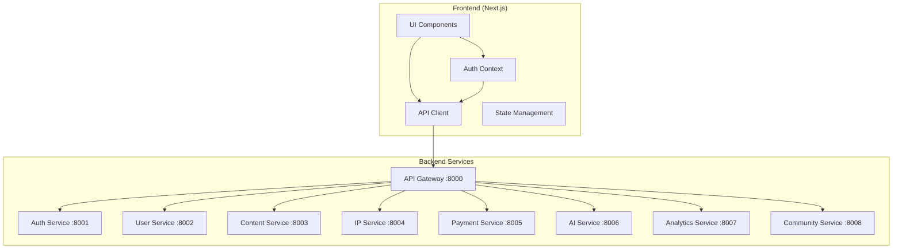
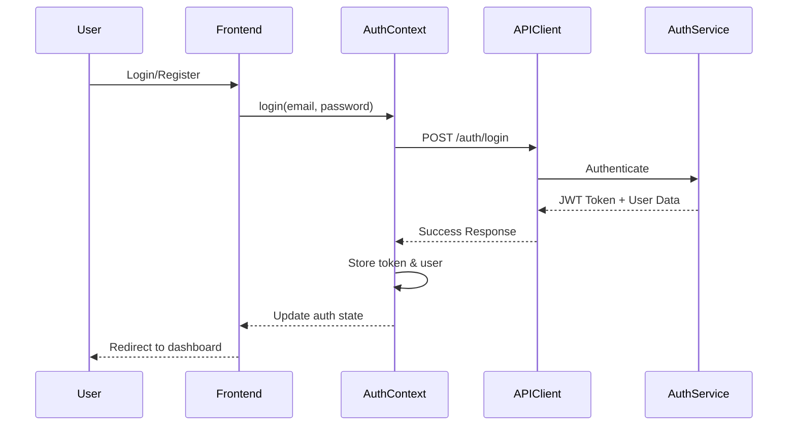

# Design Document

## Overview

This design outlines the complete integration of the Legato frontend with backend APIs to create a fully functional MVP. The solution focuses on connecting existing UI components to real backend services, implementing proper authentication flows, creating distinct user experiences for readers vs writers, and ensuring all user interactions work with actual data.

The design leverages the existing Next.js architecture with TypeScript, maintaining the current component structure while adding robust API integration, state management, and error handling.

## Architecture

### High-Level Architecture



### Authentication Flow



## Components and Interfaces

### 1. Enhanced Authentication System

#### AuthContext Enhancement
- **Current State**: Basic mock implementation with localStorage
- **Enhanced State**: Full API integration with token management, refresh logic, and role-based access

```typescript
interface User {
  id: string;
  email: string;
  name: string;
  avatar?: string;
  role: 'reader' | 'writer' | 'studio' | 'admin';
  profile: {
    bio?: string;
    location?: string;
    preferences: UserPreferences;
  };
  stats: {
    storiesRead: number;
    storiesWritten: number;
    followers: number;
    following: number;
  };
}

interface AuthContextType {
  user: User | null;
  isLoading: boolean;
  login: (email: string, password: string) => Promise<void>;
  register: (userData: RegisterData) => Promise<void>;
  logout: () => void;
  refreshToken: () => Promise<void>;
  isAuthenticated: boolean;
  hasRole: (role: string) => boolean;
}
```

#### API Client Enhancement
- **Current State**: Basic fetch calls with hardcoded endpoints
- **Enhanced State**: Centralized API client with interceptors, error handling, and automatic token refresh

```typescript
class APIClient {
  private baseURL: string;
  private token: string | null;
  
  // Automatic token attachment
  // Request/response interceptors
  // Error handling and retry logic
  // Token refresh mechanism
}
```

### 2. Dashboard System Architecture

#### User Dashboard (Reader Experience)
- **Route**: `/dashboard/reader`
- **Components**:
  - Reading progress tracker
  - Bookmarked stories grid
  - Personalized recommendations
  - Reading statistics
  - Recently read stories

#### Writer Dashboard (Creator Experience)
- **Route**: `/dashboard/writer`
- **Components**:
  - Published stories management
  - Analytics and metrics
  - Earnings overview
  - Story creation tools
  - IP protection status

#### Dashboard Router Component
```typescript
function DashboardRouter() {
  const { user } = useAuth();
  
  // Determine dashboard type based on user role and preferences
  // Route to appropriate dashboard component
  // Handle role switching for users with multiple roles
}
```

### 3. Story Management System

#### Story Creation Enhancement
- **Current State**: Basic form without image upload
- **Enhanced State**: Complete story creation with metadata, cover upload, and chapter management

```typescript
interface StoryCreationData {
  title: string;
  description: string;
  genre: string[];
  tags: string[];
  coverImage: File;
  language: string;
  targetAudience: 'general' | 'mature';
  publishingSchedule: 'immediate' | 'scheduled';
  ipProtection: boolean;
}
```

#### Story Reading Experience
- **Current State**: Basic story display
- **Enhanced State**: Immersive reading with progress tracking, bookmarking, and social features

```typescript
interface ReadingSession {
  storyId: string;
  chapterId: string;
  progress: number;
  startTime: Date;
  readingSpeed: number;
  bookmarks: Bookmark[];
}
```

### 4. Author Profile System

#### Author Profile Components
- **AuthorProfile**: Main profile display
- **AuthorStoryGrid**: Published works showcase
- **AuthorStats**: Follower count, story metrics
- **FollowButton**: Follow/unfollow functionality

```typescript
interface AuthorProfile {
  id: string;
  name: string;
  avatar: string;
  bio: string;
  stats: {
    followers: number;
    stories: number;
    totalReads: number;
  };
  stories: Story[];
  socialLinks: SocialLink[];
}
```

### 5. Community Integration

#### Comment System
- Real-time comment loading and posting
- Nested comment threads
- Like/dislike functionality
- Moderation features

#### Rating System
- Star-based rating submission
- Aggregated rating display
- Rating breakdown analytics

## Data Models

### API Response Interfaces

```typescript
// Authentication Responses
interface LoginResponse {
  token: string;
  refreshToken: string;
  user: User;
  expiresIn: number;
}

// Story Data Models
interface Story {
  id: string;
  title: string;
  description: string;
  coverImage: string;
  author: Author;
  genre: string[];
  tags: string[];
  stats: StoryStats;
  chapters: Chapter[];
  createdAt: string;
  updatedAt: string;
}

interface Chapter {
  id: string;
  title: string;
  content: string;
  wordCount: number;
  publishedAt: string;
  isPublished: boolean;
}

// Community Data Models
interface Comment {
  id: string;
  content: string;
  author: User;
  storyId: string;
  chapterId?: string;
  parentId?: string;
  likes: number;
  createdAt: string;
  replies: Comment[];
}

interface Rating {
  id: string;
  userId: string;
  storyId: string;
  rating: number;
  review?: string;
  createdAt: string;
}
```

### State Management

#### Global State Structure
```typescript
interface AppState {
  auth: AuthState;
  stories: StoriesState;
  reading: ReadingState;
  community: CommunityState;
  ui: UIState;
}

interface StoriesState {
  trending: Story[];
  userStories: Story[];
  bookmarked: Story[];
  searchResults: Story[];
  currentStory: Story | null;
  loading: boolean;
  error: string | null;
}
```

## Error Handling

### Error Handling Strategy

#### API Error Handling
```typescript
interface APIError {
  code: string;
  message: string;
  details?: any;
  statusCode: number;
}

class ErrorHandler {
  static handleAuthError(error: APIError): void;
  static handleNetworkError(error: APIError): void;
  static handleValidationError(error: APIError): void;
  static handleServerError(error: APIError): void;
}
```

#### User-Friendly Error Messages
- Network connectivity issues
- Authentication failures
- Validation errors
- Server unavailability
- Rate limiting

#### Error Recovery Mechanisms
- Automatic retry for transient failures
- Offline mode for network issues
- Form data persistence during errors
- Graceful degradation of features

## Testing Strategy

### Integration Testing Approach

#### API Integration Tests
- Authentication flow testing
- CRUD operations for stories
- Community feature interactions
- Payment flow testing
- Error scenario handling

#### Component Integration Tests
- Dashboard data loading
- Story creation workflow
- Reading experience
- Author profile functionality
- Search and discovery

#### End-to-End Testing
- Complete user registration and login
- Story creation and publishing
- Reading and community interaction
- Payment and subscription flows

### Testing Tools and Framework
- **Jest** for unit testing
- **React Testing Library** for component testing
- **MSW (Mock Service Worker)** for API mocking during tests
- **Playwright** for end-to-end testing

## Performance Optimization

### Loading and Caching Strategy

#### Data Fetching Optimization
- **React Query/TanStack Query** for server state management
- Optimistic updates for better UX
- Background data synchronization
- Intelligent caching strategies

#### Image and Asset Optimization
- Next.js Image component for cover images
- Lazy loading for story grids
- Progressive image loading
- CDN integration for static assets

#### Mobile Performance
- Code splitting by route
- Bundle size optimization
- Service worker for offline functionality
- Virtual scrolling for large lists

### Real-time Features
- WebSocket connections for live comments
- Real-time reading progress sync
- Live notification system
- Collaborative features for writers

## Security Considerations

### Authentication Security
- JWT token management with secure storage
- Automatic token refresh
- Session timeout handling
- CSRF protection

### Data Protection
- Input validation and sanitization
- XSS prevention
- Secure API communication (HTTPS)
- Rate limiting implementation

### User Privacy
- GDPR compliance considerations
- Data minimization principles
- Secure user data handling
- Privacy-focused analytics

## Mobile-First Design Considerations

### Responsive Design
- Mobile-optimized layouts
- Touch-friendly interactions
- Adaptive navigation patterns
- Performance optimization for mobile networks

### Progressive Web App Features
- Offline reading capabilities
- Push notifications
- App-like experience
- Installation prompts

### Mobile-Specific Features
- Swipe gestures for navigation
- Pull-to-refresh functionality
- Mobile-optimized forms
- Keyboard-aware layouts

## Implementation Phases

### Phase 1: Core Authentication and Navigation
- Enhanced AuthContext with real API integration
- Dashboard routing based on user roles
- Protected route implementation
- Basic error handling

### Phase 2: Story Management and Reading
- Story creation with image upload
- Enhanced reading experience
- Author profile pages
- Story discovery integration

### Phase 3: Community and Social Features
- Comment system integration
- Rating and review functionality
- Social sharing features
- User interaction tracking

### Phase 4: Advanced Features and Polish
- Real-time features
- Advanced analytics
- Performance optimizations
- Comprehensive error handling

This design provides a comprehensive foundation for transforming the current frontend from a mock-data prototype into a fully functional, production-ready application that seamlessly integrates with the Legato backend services.