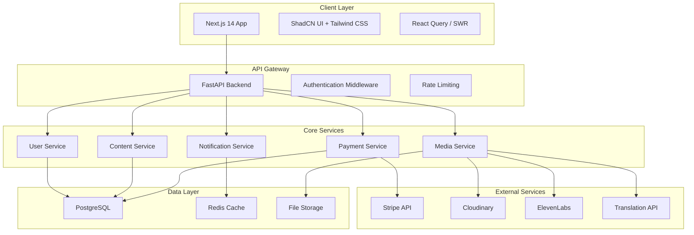

# Design Document

## Overview

Legato is a social reading and writing platform that combines content creation, consumption, and monetization in a web-first experience. The platform uses a modern architecture with Python FastAPI backend for robust API services and Next.js 14 (App Router) frontend with ShadCN UI and Tailwind CSS for a beautiful, accessible web interface.

The system is designed around two primary user roles (Readers and Writers) with a focus on real-time interaction, secure payments, media handling, and IP protection. The architecture supports scalable content delivery, integrated third-party services, and comprehensive user engagement features.

## Architecture

### High-Level Architecture



### Technology Stack

**Frontend:**
- Next.js 14 (App Router) with TypeScript
- ShadCN UI + Tailwind CSS
- React Query (TanStack Query) for data fetching
- NextAuth.js for authentication
- React Hook Form + Zod for forms
- next-themes for dark/light mode
- sonner or react-hot-toast for notifications

**Backend:**
- Python 3.11+ with FastAPI
- SQLAlchemy ORM with Alembic migrations
- Pydantic for data validation
- JWT for authentication
- Redis for caching and sessions
- Celery for background tasks

**Database:**
- PostgreSQL for primary data storage
- Redis for caching and real-time features

**External Services:**
- Stripe for payment processing
- Cloudinary for media storage and processing
- ElevenLabs for AI audio generation
- Google Translate API for content translation

## Components and Interfaces

### Frontend Architecture

#### Core Components Structure
```
src/
├── app/
│   ├── (auth)/
│   │   ├── login/
│   │   │   └── page.tsx
│   │   └── register/
│   │       └── page.tsx
│   ├── dashboard/
│   │   ├── layout.tsx
│   │   ├── page.tsx
│   │   ├── explore/
│   │   ├── library/
│   │   ├── reading-lists/
│   │   ├── community/
│   │   └── profile/
│   ├── reading/
│   │   └── [bookId]/
│   │       └── [chapterId]/
│   │           └── page.tsx
│   ├── writer/
│   │   ├── dashboard/
│   │   ├── books/
│   │   ├── [bookId]/
│   │   └── characters/
│   ├── vault/
│   │   └── page.tsx
│   └── layout.tsx
│
├── components/
│   ├── ui/               # ShadCN components
│   ├── reading/          # Reader controls
│   ├── writer/           # Writer components
│   ├── payments/         # Wallet, transactions
│   └── community/        # Comments, likes
│
├── lib/
│   ├── api.ts            # API client
│   ├── auth.ts           # Auth utilities
│   └── utils.ts          # Helpers
│
├── hooks/
│   ├── useAuth.ts
│   ├── useBooks.ts
│   └── usePayments.ts
│
├── types/
│   └── index.ts          # TypeScript interfaces
│
└── styles/
    └── globals.css       # Tailwind setup
```

#### Key Frontend Components

**Reading Interface Component:**
- Customizable text rendering with font, size, and theme controls
- Bookmark management with position tracking
- Text selection for quote generation
- Audio playback controls for generated audiobooks
- Comment system with threading support

**Payment Component:**
- Coin wallet display and management
- Stripe checkout integration
- Transaction history display
- Purchase confirmation flows

**Writer Dashboard Component:**
- Book and chapter management interface
- Character profile creation and editing
- Analytics dashboard with charts
- Content moderation tools

### Backend Architecture

#### API Structure
```
app/
├── api/
│   ├── v1/
│   │   ├── auth.py          # Authentication endpoints
│   │   ├── users.py         # User management
│   │   ├── books.py         # Book operations
│   │   ├── chapters.py      # Chapter operations
│   │   ├── payments.py      # Payment processing
│   │   ├── comments.py      # Community features
│   │   └── media.py         # Media handling
├── core/
│   ├── config.py            # Configuration management
│   ├── security.py          # Security utilities
│   └── database.py          # Database connection
├── models/
│   ├── user.py              # User data models
│   ├── book.py              # Book and chapter models
│   ├── payment.py           # Payment models
│   └── community.py         # Comment and interaction models
├── services/
│   ├── auth_service.py      # Authentication logic
│   ├── payment_service.py   # Payment processing
│   ├── media_service.py     # Media operations
│   └── notification_service.py # Notification handling
└── utils/
    ├── license_generator.py # IP license generation
    └── validators.py        # Data validation
```

#### Core API Endpoints

**Authentication & Users:**
- `POST /api/v1/auth/register` - User registration
- `POST /api/v1/auth/login` - User authentication
- `GET /api/v1/users/profile` - Get user profile
- `PUT /api/v1/users/profile` - Update user profile
- `POST /api/v1/users/vault-password` - Set vault password

**Books & Content:**
- `GET /api/v1/books` - List books with filters
- `POST /api/v1/books` - Create new book (writers only)
- `GET /api/v1/books/{id}` - Get book details
- `GET /api/v1/books/{id}/chapters` - Get book chapters
- `POST /api/v1/chapters` - Create new chapter
- `PUT /api/v1/chapters/{id}` - Update chapter content

**Payments & Monetization:**
- `GET /api/v1/wallet` - Get wallet balance
- `POST /api/v1/wallet/topup` - Create Stripe checkout session
- `POST /api/v1/purchases` - Purchase book or chapter
- `GET /api/v1/transactions` - Get transaction history

**Community Features:**
- `POST /api/v1/comments` - Create comment
- `GET /api/v1/comments/{chapter_id}` - Get chapter comments
- `POST /api/v1/comments/{id}/like` - Like comment
- `POST /api/v1/comments/{id}/report` - Report comment

**Media & AI Services:**
- `POST /api/v1/media/upload` - Upload images to Cloudinary
- `POST /api/v1/audio/generate` - Generate audiobook chapter
- `POST /api/v1/quotes/generate` - Generate quote image
- `POST /api/v1/translate` - Translate chapter content

## Data Models

### Core Database Schema

#### Users Table
```sql
CREATE TABLE users (
    id UUID PRIMARY KEY DEFAULT gen_random_uuid(),
    email VARCHAR(255) UNIQUE NOT NULL,
    username VARCHAR(100) UNIQUE NOT NULL,
    password_hash VARCHAR(255) NOT NULL,
    profile_picture_url TEXT,
    is_writer BOOLEAN DEFAULT FALSE,
    vault_password_hash VARCHAR(255),
    theme_preference VARCHAR(20) DEFAULT 'light',
    coin_balance INTEGER DEFAULT 0,
    created_at TIMESTAMP DEFAULT NOW(),
    updated_at TIMESTAMP DEFAULT NOW()
);
```

#### Books Table
```sql
CREATE TABLE books (
    id UUID PRIMARY KEY DEFAULT gen_random_uuid(),
    title VARCHAR(255) NOT NULL,
    description TEXT,
    cover_image_url TEXT,
    author_id UUID REFERENCES users(id),
    pricing_model VARCHAR(20) NOT NULL, -- 'free', 'fixed', 'per_chapter'
    fixed_price INTEGER, -- in coins
    per_chapter_price INTEGER, -- in coins
    genre VARCHAR(100),
    tags TEXT[], -- PostgreSQL array
    is_published BOOLEAN DEFAULT FALSE,
    license_hash VARCHAR(255) UNIQUE NOT NULL,
    created_at TIMESTAMP DEFAULT NOW(),
    updated_at TIMESTAMP DEFAULT NOW()
);
```

#### Chapters Table
```sql
CREATE TABLE chapters (
    id UUID PRIMARY KEY DEFAULT gen_random_uuid(),
    book_id UUID REFERENCES books(id),
    title VARCHAR(255) NOT NULL,
    content TEXT NOT NULL,
    chapter_number INTEGER NOT NULL,
    word_count INTEGER,
    is_published BOOLEAN DEFAULT FALSE,
    audio_url TEXT,
    created_at TIMESTAMP DEFAULT NOW(),
    updated_at TIMESTAMP DEFAULT NOW(),
    UNIQUE(book_id, chapter_number)
);
```

#### User Library Table
```sql
CREATE TABLE user_library (
    id UUID PRIMARY KEY DEFAULT gen_random_uuid(),
    user_id UUID REFERENCES users(id),
    book_id UUID REFERENCES books(id),
    is_in_vault BOOLEAN DEFAULT FALSE,
    added_at TIMESTAMP DEFAULT NOW(),
    UNIQUE(user_id, book_id)
);
```

#### Bookmarks Table
```sql
CREATE TABLE bookmarks (
    id UUID PRIMARY KEY DEFAULT gen_random_uuid(),
    user_id UUID REFERENCES users(id),
    chapter_id UUID REFERENCES chapters(id),
    position_percentage DECIMAL(5,2),
    created_at TIMESTAMP DEFAULT NOW(),
    UNIQUE(user_id, chapter_id)
);
```

#### Comments Table
```sql
CREATE TABLE comments (
    id UUID PRIMARY KEY DEFAULT gen_random_uuid(),
    chapter_id UUID REFERENCES chapters(id),
    user_id UUID REFERENCES users(id),
    parent_id UUID REFERENCES comments(id),
    content TEXT NOT NULL,
    like_count INTEGER DEFAULT 0,
    is_reported BOOLEAN DEFAULT FALSE,
    is_deleted BOOLEAN DEFAULT FALSE,
    created_at TIMESTAMP DEFAULT NOW()
);
```

#### Transactions Table
```sql
CREATE TABLE transactions (
    id UUID PRIMARY KEY DEFAULT gen_random_uuid(),
    user_id UUID REFERENCES users(id),
    transaction_type VARCHAR(20) NOT NULL, -- 'topup', 'purchase'
    amount INTEGER NOT NULL, -- in coins
    stripe_session_id VARCHAR(255),
    book_id UUID REFERENCES books(id),
    chapter_id UUID REFERENCES chapters(id),
    status VARCHAR(20) DEFAULT 'pending',
    created_at TIMESTAMP DEFAULT NOW()
);
```

### Data Relationships

- Users can be both readers and writers (is_writer flag)
- Writers own multiple books, each book has multiple chapters
- Users have a library of books (purchased or free)
- Users can bookmark positions in chapters
- Comments are threaded (parent_id for replies)
- Transactions track both wallet top-ups and content purchases

## Error Handling

### Frontend Error Handling

**Network Errors:**
- Implement retry logic with exponential backoff
- Show user-friendly offline messages
- Cache critical data locally for offline access

**Authentication Errors:**
- Automatic token refresh for expired JWTs
- Redirect to login on authentication failures
- Secure token storage using HTTP-only cookies

**Payment Errors:**
- Clear error messages for failed transactions
- Retry mechanisms for network-related payment failures
- Fallback to manual retry options

### Backend Error Handling

**API Error Responses:**
```python
class APIError(Exception):
    def __init__(self, status_code: int, message: str, details: dict = None):
        self.status_code = status_code
        self.message = message
        self.details = details or {}

# Standard error response format
{
    "error": {
        "code": "INSUFFICIENT_COINS",
        "message": "Not enough coins to complete purchase",
        "details": {
            "required": 50,
            "available": 25
        }
    }
}
```

**Database Error Handling:**
- Connection pooling with automatic retry
- Transaction rollback on failures
- Graceful degradation for non-critical features

**External Service Error Handling:**
- Circuit breaker pattern for third-party APIs
- Fallback mechanisms (e.g., cached translations)
- Async retry queues for media processing

## Testing Strategy

### Frontend Testing Approach

Since you prefer testing by running the application rather than automated tests, the testing strategy focuses on:

**Manual Testing Workflows:**
1. **Authentication Flow Testing:**
   - Register new account → verify email validation
   - Login with valid/invalid credentials
   - Profile updates and theme changes

2. **Reading Experience Testing:**
   - Book discovery and filtering
   - Reading interface customization
   - Bookmark creation and navigation
   - Audio generation and playback

3. **Payment Flow Testing:**
   - Wallet top-up via Stripe (use test mode)
   - Book/chapter purchases
   - Transaction history verification

4. **Community Feature Testing:**
   - Comment creation and threading
   - Like functionality and author badges
   - Report and moderation features

5. **Writer Feature Testing:**
   - Book and chapter creation
   - Character profile management
   - Analytics dashboard
   - Content moderation tools

### Backend Testing Strategy

**API Testing with Postman/Insomnia:**
- Create collections for each API endpoint
- Test authentication flows and token validation
- Verify data validation and error responses
- Test payment webhook handling

**Database Testing:**
- Verify data integrity constraints
- Test transaction rollbacks
- Validate foreign key relationships
- Check performance with sample data

**Integration Testing:**
- Test Stripe webhook processing
- Verify Cloudinary image uploads
- Test ElevenLabs audio generation
- Validate translation API integration

### Performance Testing

**Load Testing Scenarios:**
- Concurrent user authentication
- Multiple simultaneous book purchases
- High-volume comment creation
- Media upload stress testing

**Monitoring and Metrics:**
- API response times
- Database query performance
- External service latency
- User engagement metrics

## Security Considerations

### Authentication & Authorization
- JWT tokens with short expiration times
- Refresh token rotation
- Role-based access control (Reader/Writer)
- Secure password hashing with bcrypt

### Data Protection
- Input validation and sanitization
- SQL injection prevention via ORM
- XSS protection for user-generated content
- HTTPS enforcement for all communications

### Payment Security
- PCI compliance through Stripe
- Webhook signature verification
- Secure handling of payment data
- Transaction audit logging

### Content Security
- License hash generation for IP protection
- Secure file upload validation
- Content moderation capabilities
- User data privacy controls

This design provides a comprehensive foundation for building the Legato platform with modern architecture, scalable components, and robust security measures while supporting your preference for manual testing and iterative development.
