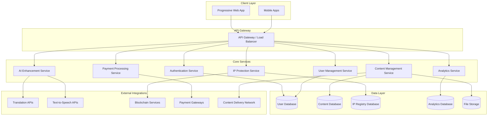
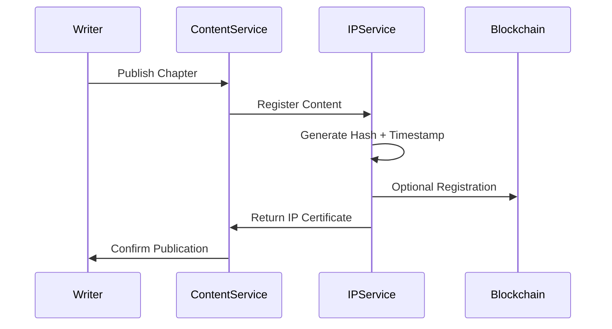
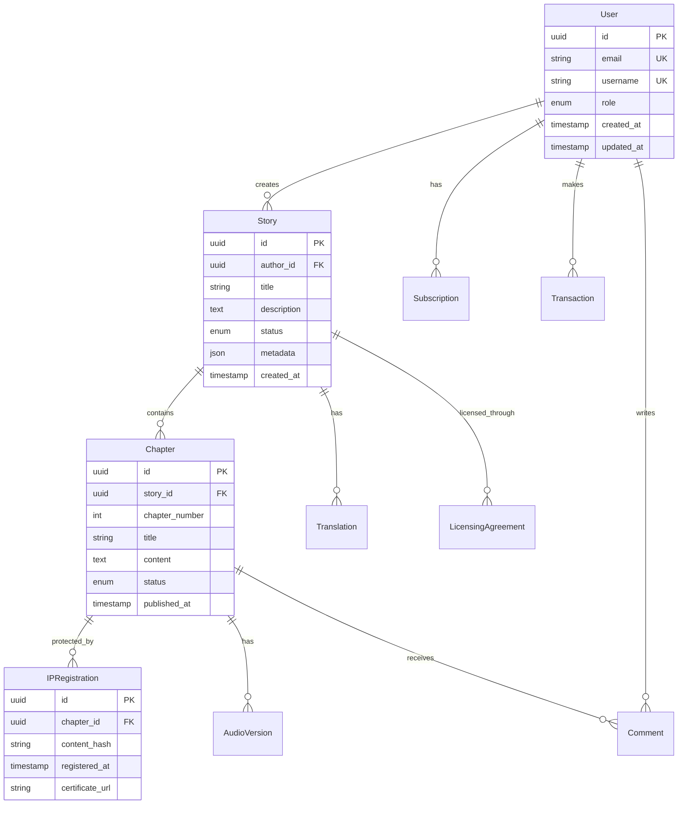

# Legato Platform Design Document

## Overview

Legato is a mobile-first serialized storytelling platform that combines content creation, IP protection, and global monetization. The platform architecture prioritizes scalability, security, and performance while enabling writers to protect their intellectual property and reach global audiences through AI-powered content enhancement.

The system follows a microservices architecture with clear separation between content management, user services, payment processing, and AI integrations. This design ensures modularity, scalability, and maintainability while supporting the platform's core mission of fair writer compensation and IP protection.

## Architecture

### High-Level Architecture



### Technology Stack

**Backend Services (FastAPI)**
- FastAPI for high-performance REST APIs
- PostgreSQL for relational data (users, content metadata, transactions)
- Redis for caching and session management
- MongoDB for analytics and logging data
- Celery for background task processing
- Docker containers for service deployment

**Frontend (Progressive Web App)**
- React/Next.js for responsive web interface
- TypeScript for type safety
- Tailwind CSS for mobile-first styling
- Service Workers for offline capabilities
- WebSocket connections for real-time features

**Infrastructure**
- Kubernetes for container orchestration
- AWS/GCP for cloud hosting
- CloudFront/CloudFlare for CDN
- ElasticSearch for content search
- Prometheus/Grafana for monitoring

## Components and Interfaces

### Authentication Service

**Purpose**: Manages user authentication, authorization, and session management.

**Key Components**:
- JWT token management with refresh token rotation
- OAuth2 integration for social login
- Role-based access control (Writer, Reader, Studio, Admin)
- Multi-factor authentication for high-value accounts

**API Endpoints**:
```
POST /auth/register - User registration
POST /auth/login - User authentication
POST /auth/refresh - Token refresh
POST /auth/logout - Session termination
GET /auth/profile - User profile retrieval
PUT /auth/profile - Profile updates
```

**Design Rationale**: Separate authentication service enables independent scaling and security updates. JWT tokens provide stateless authentication suitable for mobile clients.

### User Management Service

**Purpose**: Handles user profiles, preferences, and account management.

**Key Components**:
- User profile management (writers vs readers)
- Preference storage (language, genres, notifications)
- Subscription and membership management
- Social features (following, blocking, reporting)

**Database Schema**:
```sql
users (id, email, username, role, created_at, updated_at)
user_profiles (user_id, display_name, bio, avatar_url, preferences)
user_subscriptions (user_id, plan_type, status, expires_at)
user_relationships (follower_id, following_id, relationship_type)
```

### Content Management Service

**Purpose**: Core content creation, storage, and delivery functionality.

**Key Components**:
- Story and chapter management
- Content versioning and history
- Metadata management (tags, categories, ratings)
- Content moderation and approval workflows

**API Design**:
```
POST /stories - Create new story
GET /stories/{id} - Retrieve story details
PUT /stories/{id} - Update story metadata
POST /stories/{id}/chapters - Add new chapter
GET /stories/{id}/chapters/{chapter_id} - Get chapter content
PUT /chapters/{id} - Update chapter content
```

**File Storage Strategy**:
- Original content stored in encrypted format
- CDN distribution for global access
- Automatic backup and versioning
- Content compression for mobile delivery

**Design Rationale**: Separate content service allows independent scaling based on read/write patterns. Versioning ensures IP protection while enabling content updates.

### IP Protection Service

**Purpose**: Provides cryptographic proof of authorship and rights management.

**Key Components**:
- Digital fingerprinting using SHA-256 hashing
- Timestamp authority integration
- Certificate of Authorship generation
- Blockchain registration (optional)
- Plagiarism detection tools

**IP Registration Flow**:


**Database Schema**:
```sql
ip_registrations (id, content_id, hash, timestamp, certificate_url)
ip_certificates (id, registration_id, certificate_data, blockchain_tx)
licensing_agreements (id, content_id, licensee_id, terms, revenue_share)
```

**Design Rationale**: Cryptographic hashing provides tamper-proof evidence of creation time. Blockchain integration offers additional verification for high-value content.

### Payment Processing Service

**Purpose**: Handles all monetary transactions, revenue distribution, and financial reporting.

**Key Components**:
- Multi-currency coin system
- Subscription management
- Revenue sharing calculations
- Payout processing
- Financial reporting and tax compliance

**Revenue Distribution Logic**:
```python
def calculate_revenue_share(transaction_type, amount):
    if transaction_type == "coin_purchase":
        writer_share = amount * 0.70  # 70% to writer
        platform_share = amount * 0.30  # 30% to platform
    elif transaction_type == "subscription":
        # Distributed based on engagement metrics
        writer_share = calculate_engagement_share(amount)
    elif transaction_type == "licensing":
        writer_share = amount * 0.85  # 85% to writer
        platform_share = amount * 0.15  # 15% to platform
    
    return writer_share, platform_share
```

**Payment Gateway Integration**:
- Stripe for international payments
- Regional payment providers (M-Pesa, Payme, etc.)
- Cryptocurrency support for global accessibility
- Automated tax calculation and reporting

### AI Enhancement Service

**Purpose**: Provides AI-powered content enhancement including translation and audiobook generation.

**Key Components**:
- Translation service integration (Google Translate, DeepL)
- Text-to-speech conversion with voice selection
- Content adaptation tools (script generation)
- Quality assessment and improvement suggestions

**Translation Workflow**:


**Audiobook Generation**:
- Voice selection based on content genre and target audience
- Chapter-level audio generation with consistent narrator
- Audio quality optimization for mobile streaming
- Synchronization markers for text-audio alignment

**Design Rationale**: AI services are separated to enable independent scaling and easy integration of new AI providers. Asynchronous processing ensures responsive user experience.

### Analytics Service

**Purpose**: Collects, processes, and presents performance metrics for creators and platform optimization.

**Key Components**:
- Real-time engagement tracking
- Revenue analytics and forecasting
- Reader behavior analysis
- Content performance metrics
- A/B testing framework

**Metrics Collection**:
```javascript
// Client-side tracking
trackEvent('chapter_read', {
  story_id: storyId,
  chapter_id: chapterId,
  read_duration: duration,
  completion_percentage: percentage
});

// Server-side aggregation
aggregateMetrics('daily_engagement', {
  story_id: storyId,
  total_reads: count,
  average_duration: avg_duration,
  retention_rate: retention
});
```

## Data Models

### Core Entity Relationships



### Payment and Revenue Models

```sql
-- Coin system for microtransactions
CREATE TABLE coin_packages (
    id UUID PRIMARY KEY,
    name VARCHAR(100),
    coin_amount INTEGER,
    price_usd DECIMAL(10,2),
    bonus_percentage DECIMAL(5,2)
);

-- Transaction tracking
CREATE TABLE transactions (
    id UUID PRIMARY KEY,
    user_id UUID REFERENCES users(id),
    transaction_type VARCHAR(50),
    amount DECIMAL(10,2),
    currency VARCHAR(3),
    status VARCHAR(20),
    created_at TIMESTAMP
);

-- Revenue distribution
CREATE TABLE revenue_shares (
    id UUID PRIMARY KEY,
    content_id UUID,
    writer_id UUID REFERENCES users(id),
    transaction_id UUID REFERENCES transactions(id),
    writer_amount DECIMAL(10,2),
    platform_amount DECIMAL(10,2),
    processed_at TIMESTAMP
);
```

## Error Handling

### Error Classification and Response Strategy

**Client Errors (4xx)**:
- 400 Bad Request: Invalid input validation
- 401 Unauthorized: Authentication required
- 403 Forbidden: Insufficient permissions
- 404 Not Found: Resource doesn't exist
- 429 Too Many Requests: Rate limiting

**Server Errors (5xx)**:
- 500 Internal Server Error: Unexpected system failure
- 502 Bad Gateway: External service unavailable
- 503 Service Unavailable: Temporary overload
- 504 Gateway Timeout: External service timeout

**Error Response Format**:
```json
{
  "error": {
    "code": "INVALID_CONTENT_FORMAT",
    "message": "Chapter content must be between 100 and 10000 characters",
    "details": {
      "field": "content",
      "current_length": 50,
      "min_length": 100,
      "max_length": 10000
    },
    "timestamp": "2025-01-11T10:30:00Z",
    "request_id": "req_123456789"
  }
}
```

### Resilience Patterns

**Circuit Breaker**: Protect against cascading failures in external service calls
**Retry Logic**: Exponential backoff for transient failures
**Graceful Degradation**: Fallback to cached content when services are unavailable
**Bulkhead Pattern**: Isolate critical services to prevent total system failure

### Monitoring and Alerting

**Health Checks**:
- Service availability monitoring
- Database connection health
- External API response times
- Queue processing delays

**Alert Thresholds**:
- Error rate > 5% triggers immediate alert
- Response time > 2s triggers warning
- Payment processing failures trigger critical alert
- IP service unavailability triggers urgent alert

## Testing Strategy

### Unit Testing
- Service layer business logic testing
- Data model validation testing
- Utility function testing
- Mock external dependencies

### Integration Testing
- API endpoint testing with real databases
- Service-to-service communication testing
- Payment flow integration testing
- AI service integration testing

### End-to-End Testing
- Complete user journey testing (registration to monetization)
- Cross-platform compatibility testing
- Performance testing under load
- Security penetration testing

### Testing Tools and Framework
```python
# FastAPI testing example
def test_create_story():
    response = client.post("/stories", json={
        "title": "Test Story",
        "description": "A test story",
        "genre": "fiction"
    }, headers={"Authorization": f"Bearer {auth_token}"})
    
    assert response.status_code == 201
    assert response.json()["title"] == "Test Story"
    assert "id" in response.json()
```

### Performance Testing
- Load testing for concurrent users (target: 10,000 concurrent readers)
- Stress testing for peak traffic scenarios
- Database performance testing for large content volumes
- CDN performance testing for global content delivery

**Performance Targets**:
- API response time < 200ms for 95% of requests
- Page load time < 2s on 3G networks
- Content search results < 500ms
- Payment processing < 5s end-to-end

This design provides a robust, scalable foundation for the Legato platform while addressing all requirements for IP protection, global monetization, and mobile-first user experience.